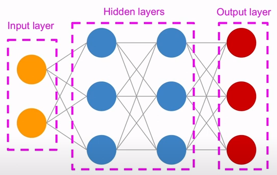
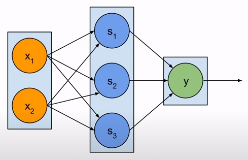
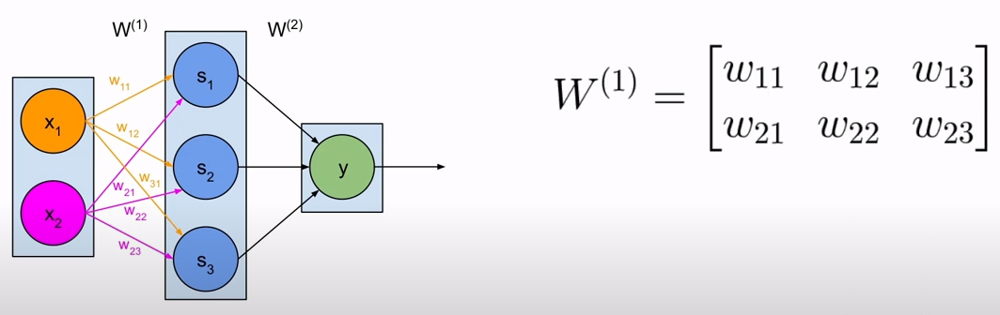
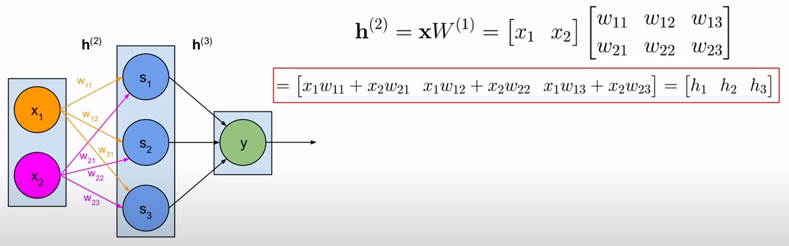
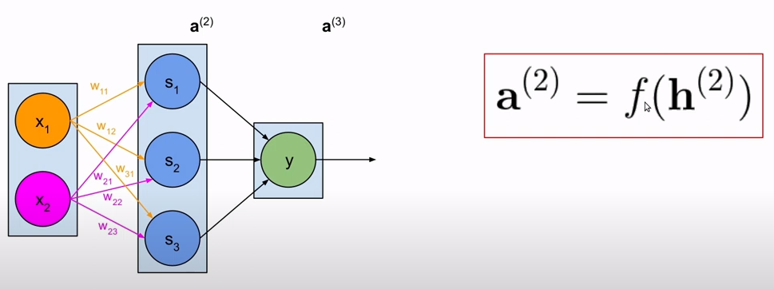
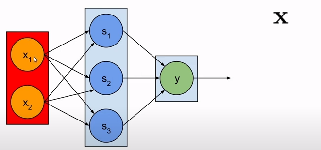
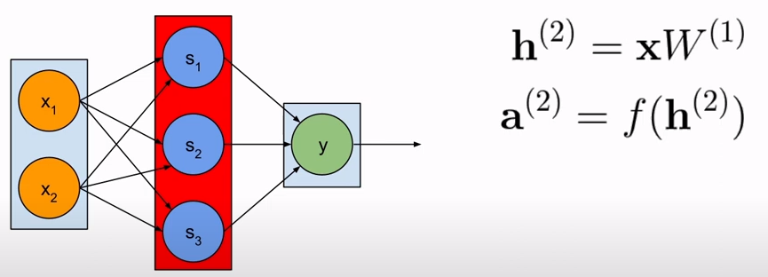
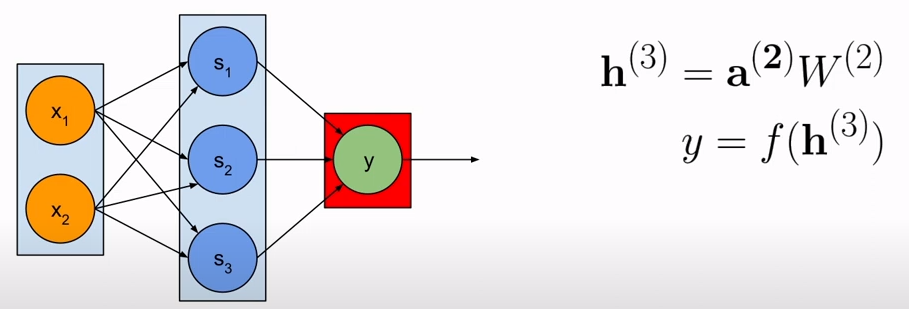
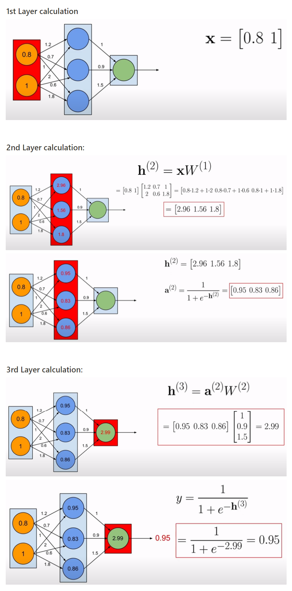

## Table of Contents

1. [What is an Artificial Neuron?](#what-is-an-artificial-neuron)
2. [Artificial Neurons and Layers](#artificial-neurons-and-layers)
3. [Neural Network ( NN )](#neural-network--nn)
4. [Why is a neural network needed?](#why-is-a-neural-network-needed)
5. [The components of an artificial neural network (ANN)](#the-components-of-an-artificial-neural-network-ann)
6. [The Multilayer Perceptron (MLP)](#the-multilayer-perceptron-mlp)
7. [Computation in MLP](#computation-in-mlp)
   1. [weights](#1-weights)
   2. [net input](#2-net-input)
   3. [activation](#3-activation)
   4. [computation in action (layers-wise)](#4-computation-in-action-layers-wise)
8. [Activations vs. Activation Functions](#activations-vs-activation-functions)

&nbsp;

## What is an Artificial Neuron?

- An Artificial Neuron is a fundamental computational unit that processes information
- It takes multiple input values, applies weights to these inputs, sums them up, and passes the result through an activation function to produce an output
- This output is then used as input for other neurons in the network

&nbsp;

## Artificial Neurons and Layers

- Neurons are organized into layers within the network, such as input, hidden, and output layers
- All the layers work together to perform complex tasks like pattern recognition and decision making

&nbsp;

## Neural Network ( NN )

- A Neural Network (NN) is a machine learning model inspired by the human brain
- It consists of interconnected artificial neurons organized into layers
- Neurons are the basic building blocks of Neural Networks (NN)
- These neurons process and transform data, learning patterns and making predictions

&nbsp;

## Why is a neural network needed?

- Single neuron works for linear problems
- But NNs can handle complex, non-linear problems that single neurons cannot address

&nbsp;

## The components of an artificial neural network (ANN)

- Neurons
- Input, Hidden & Output layers
- Weighted connections
- Activation function

&nbsp;

## The Multilayer Perceptron (MLP)

- MLP is a specific type of artificial neural network (ANN)
- In another words, MLP is one specific NN architecture within ANN category (MLPs are a subset of ANNs)
- Feedforward (forward propagation) neural network
- MLP structure ==== ANN structure
- Components in MLP :
  - Weights
  - Net inputs (sum of weighted inputs)
  - Activations (output of neurons to next layer)

&nbsp;

## Computation in MLP

### 1. Weights

### 2. Net Input

### 3. Activation

  

### 4. Computation in action (layers-wise)

- This is layer 1 (Input Layer)
- In here, X = input vector

&nbsp;

- This is layer 2 (Hidden Layer)
- This layer produces two things,
  - net input : h(2)
  - activation : a(2)
- In here, W(1) is weight matrix

&nbsp;

- This is layer 3 (Output Layer)

&nbsp;

   

## Activations vs. Activation Functions

- <ins>**Activation Functions :**</ins>

  - Activation fn. are mathematical functions applied to the weighted sum of inputs to a neuron
  - These function determines the neuron's output (activation)
  - Activation functions introduce non-linearity to the network
  - Common activation functions include,
    - sigmoid
    - ReLU (Rectified Linear Unit)
    - tanh (hyperbolic tangent)

- <ins>**Activation(s) :**</ins>
  - 'Activation' refer to the actual output values produced by the neurons after the activation function has been applied
