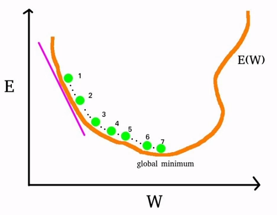

## Table of Contents

1. [Training a Neural Network :](#training-a-neural-network)
   1. [Get prediction](#)
   2. [Calculate an error](#2-calculate-error)
   3. [Calculate gradient of the error function](#3-calculate-gradient-of-the-error-function)
   4. [Update parameters](#4-update-parameters)

&nbsp;

## Training a Neural Network

1. Tweak weights of the connections :

   - Initialize the neural network with random weights
   - During training, adjust these weights to minimize prediction errors
   - Weight adjustments done through a process called <ins>**backpropagation**</ins>

&nbsp;

2. Feed training data (input + target) to the network :
   - Provide the neural network with input data (e.g., images, text, numerical values) and the corresponding target (desired) output.
   - The network processes the input and compares its predictions to the targets

&nbsp;

3. Iterative adjustments :

   - During iteration, the network's weights are updated to reduce errors through a process like <ins>**gradient descent**</ins> or stochastic gradient descent
   - Compute the error between the network's predictions and the targets
   - Repeat this process iteratively (through multiple epochs) until get the satisfied model accuracy/performance   (Multiple iterations may be performed within a single epoch)

&nbsp;

- _weights in a neural network are adjusted and optimized during the training process to improve the model's performance_
- _weights are updated to minimize the difference between predicted and actual outcomes_

&nbsp;

&nbsp;

| Main Process        | Sub tasks                                                                              |
| :------------------ | :------------------------------------------------------------------------------------- |
| Forward Propagation | 1. Get prediction   2. Calculate the error                                          |
| Backpropagation     | 3. Calculate gradient of the error function over the weights   4. Update parameters |
|                     |                                                                                        |

_The gradient in neural networks indicates the direction in which the model's parameters (weights) should be updated to improve performance_

&nbsp;

### 2. Calculate Error

- To calculate an error, we using error functions
- Error function is a function with two variables
- **E = E ( p, y )**
  - 'p' represents the model's prediction
  - 'y' represents the expected or actual outcome
- The quadratic error function is one of the common examples of an error function
  - _Quadratic error fn. ( E ) = E ( p, y ) = 1/2 \* ( p, y )2_

&nbsp;

### 3. Calculate gradient of the error function

- To calculate the gradient of the error function we should calculate the derivative of the error function (E) with respect to each weight (W) in the neural network

- W1 and W2 are weight matrixes
- Before calculating the gradient, Let's assume a neural network as a complex function ( F )
  - **F = F ( x, W )**
  - In here,
    - x = input vector
    - W = all the weights

&nbsp;

### RECAP: Elements of the Neural Network

- x = inputs
- a = activations
  - a1 = activation of the first layer
  - a2 = activation of the second layer
  - a3 = prediction
- W = Weight matrixes
  - W1 = weights for the first layer
  - W2 = weights for the second layer
- h = net input vectors
  - h2 = all the net inputs for the second layer
  - h3 = all the net inputs for the third layer

&nbsp;

### Gradient calculation process

   

### 4. Update parameters

- To update the parameters, we need algorithm called 'Gradient descent'

  - _After calculating the error (or loss) of a neural network, the most common method for updating the parameters (weights and biases) of the network to minimize this error is through an <ins>optimization algorithm</ins> called "Gradient Descent"_

  - _Gradient Descent used in both ML and DL_

  - _It works by iteratively adjusting the model's parameters in the direction that reduces the error_
    - _For each iteration, the algorithm calculates the gradient of the loss function, then takes a step in the opposite direction to reduce the loss_

- Step = Learning Rate
  - _The size of the step taken during each iteration is determined by the learning rate, which is a hyperparameter_
  - _A small learning rate makes learning slow, and a large one can make it unstable_
  - _Finding the right learning rate is crucial for successful training_

<!-- &nbsp; -->

#### How Gradient descent works?

  

- X axis = weights
- Y axis = errors
- E(W) = Error function _(orange curve)_
- Gradient = _purple straight line_

&gt; We calculate the gradient of 1st point _(1st green point)_ and then move to next one. This process continue until we get the global minimum.  
&gt; Positions for gradient calculation _(green points)_ are identified by learning rates
