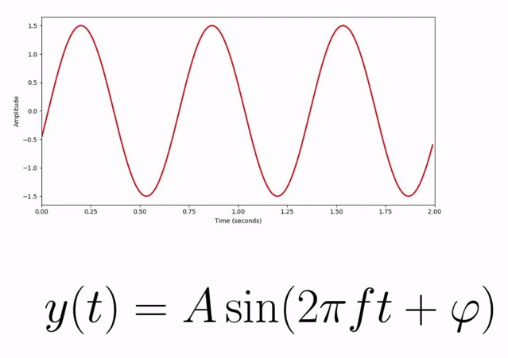
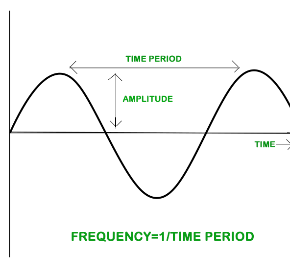

## Table of Contents

&nbsp;

## What is sound?

- Sound is produced by the vibration of an object, which causes oscillations in air molecules.
- These oscillations create alternating changes in air pressure, resulting in the propagation of sound waves through the air.

&nbsp;

## Waveform

- Elements of the wave (sound wave)

  1. time period ( T )
  2. frequency ( f ): _inverse of the period ( f = 1 / T )_
  3. amplitude ( A ): _power of wave_

    

