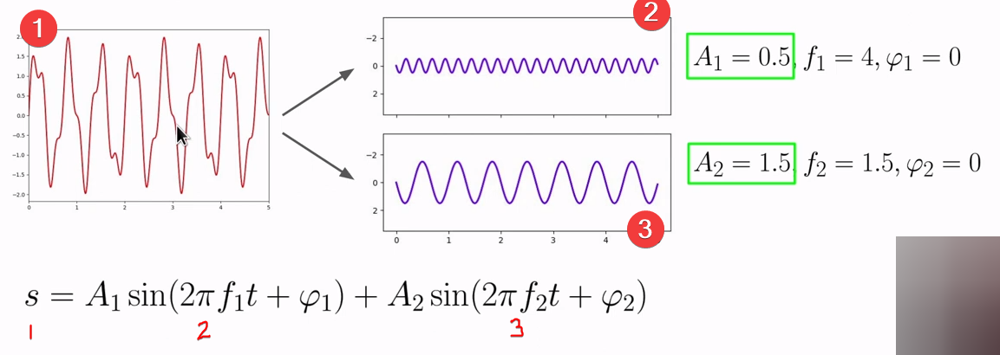

## Table of Contents

1. [What is sound?](#what-is-sound)
2. [Waveform](#waveform)
   - [How frequency and amplitude related to pitch and loudness](#how-frequency-and-amplitude-related-to-pitch-and-loudness)
3. [Analog-Digital Conversion (ADC)](#analog-digital-conversion-adc)
4. [Sampling rate & Bit depth](#sampling-rate--bit-depth)
5. [Real-world Sound Wave and Fourier transform](#real-world-sound-wave-and-fourier-transform)
   - [Fourier transform explanation](#fourier-transform-explanation)
6. [Solution for information loss in Fourier transform: STFT](#solution-for-information-loss-in-fourier-transform-stft)
   - [How to STFT works?](#how-to-stft-works)
7. [DL pre-proprocessing pipeline for audio data](#dl-pre-proprocessing-pipeline-for-audio-data)
8. [Mel Frequency Cepstral Coefficients (MFCCs)](#mel-frequency-cepstral-coefficients-mfccs)

&nbsp;

## What is sound?

- Sound is produced by the vibration of an object, which causes oscillations in air molecules.
- These oscillations create alternating changes in air pressure, resulting in the propagation of sound waves through the air.

&nbsp;

## Waveform

- Elements of the wave (sound wave)

  1. time period ( T )
  2. frequency ( f ): _inverse of the period ( f = 1 / T )_
  3. amplitude ( A ): _power of wave_

&nbsp;

### How frequency and amplitude related to pitch and loudness

- higher frequency has higher pitch
- larger amplitudes are louder

  

## Analog-Digital Conversion (ADC)

- ADC is the process of converting continuous analog signals into discrete digital values

- This is done by <ins>**sampling**</ins> the analog signal at regular intervals and <ins>**quantizing**</ins> each sample to a specific digital value

- The key parameters/metrics in ADC :
  1. sampling rate (how often the analog signal is measured)
  2. bit depth (the number of binary digits used to represent each sample)

- Blue points are taken as digital values

&nbsp;

## Sampling rate & Bit depth

e.g: Compact Disk (CD) has following values for sampling rate & bit depth.

1. Sample Rate: 44,100 Hz :

   - This means that the audio on a CD is sampled 44,100 times per second.
   - In other words, the analog audio signal is measured 44,100 times every second to capture its digital representation (takes more that 44,000 amplitude points in a second).

2. Bit Depth: 16 bits per channel :
   - The bit depth indicates the resolution of each sample.
   - In this case, there are 16 bits available to represent the amplitude of the audio signal at each sample point.
   - A 16-bit bit depth allows for 65,536 ( 216 ) possible amplitude values, providing a relatively high level of detail and dynamic range for audio representation.

&nbsp;

## Real-world Sound Wave and Fourier transform

This waveform is complex, so we try simplify it by fransforming

### Fourier transform explanation :

- Fourier transform is a mathematical technique
- **used in signal processing** to break down a complex, time-domain signal (such as sound or any waveform) into its constituent **sine waves** of different frequencies
- It reveals the individual frequency components that make up the original signal
- This **decomposition** allows us to analyze and manipulate signals in the frequency domain, making it easier to work with different aspects of the signal, like identifying specific frequencies or filtering out unwanted noise

&nbsp;

- FFT = fourier transform
- transform happens from time domain to frequency domain
- we lost time information

&nbsp;

## Solution for information loss in Fourier transform: STFT

- STFT stands for: Short Time Fourier Transform
- Computes several FFT at different intervals
- Preserves time information
- Fixed frame size (e.g.: 2048 samples)
- Gives a spectrogram (time + frequency + magnitude)

&nbsp;

- There are three axis in STFT:
  1. y-axis: frequency
  2. x-axis: time
  3. 3rd-axis: given by colors (purple to orange)

&nbsp;

### How to STFT works?

   

## DL pre-proprocessing pipeline for audio data

### why we should learn about spectrogram?

- Spectrograms are indeed a fundamental representation when working with audio data in deep learning
- A spectrogram is a visual representation of the spectrum of frequencies in a sound signal as they vary with time
- It is created by taking a series of short-time Fourier transforms of the audio signal, which allows us to see how the frequency content of the audio signal changes over time
- In deep learning for audio, spectrograms are often used as input data

#### "Whole pre-proprocessing pipeline for audio data for DL based on spectrogram"

_However, it's essential to note that audio-based deep learning may involve various other representations and techniques depending on the specific task. For example, raw audio waveforms, mel-frequency cepstral coefficients (MFCCs), or other time-frequency representations can also be used in different contexts_

&nbsp;

## Mel Frequency Cepstral Coefficients (MFCCs)

- Mel Frequency Cepstral Coefficients (MFCCs) are a set of numbers that describe the texture and tonal qualities of a sound.
- They're extracted from the frequency content of an audio signal and mimic how our ears process sound.
- Typically, 13 to 40 coefficients are calculated for short segments of audio, capturing details about the sound's character at each moment.
- MFCCs are commonly used in tasks like speech recognition and music analysis (genre classification, instrument classification).

<!-- &nbsp; -->

