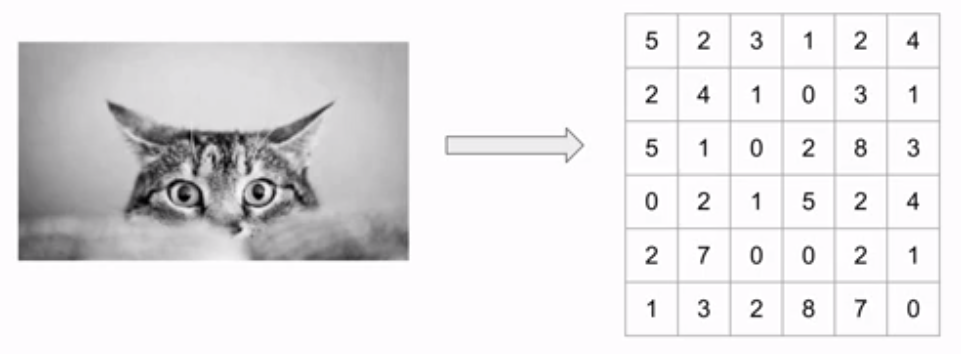

## Table of Contents

1. [What is a Convolutional Neural Network?](#what-is-a-convolutional-neural-network)
2. [Architecture & Layers of a CNN](#architecture--layers-of-a-cnn)
3. [Key benefits of CNN compared to MLP](#key-benefits-of-cnn-compared-to-mlp)
4. [CNN Components](#cnn-components)
5. [Convolution](#convolution)
   1. [Grayscale Image](#grayscale-image)
   2. [How does Convolution work with an image?](#how-does-convolution-work-with-an-image)
   3. [Kernels](#kernels)
   4. [Architecture decisions for convolution](#architecture-decisions-for-convolution)
6. [Pooling](#pooling)
7. [How does pooling work?](#how-does-pooling-work)
8. [CNN Architecture](#cnn-architecture)
9. [How does convolution/pooling apply to audio?](#how-does-convolutionpooling-apply-to-audio)
10. [Preparing MFCCs for a CNN](#preparing-mfccs-for-a-cnn)

&nbsp;

## What is a Convolutional Neural Network?

- Is a deep learning model designed for processing and analyzing visual data _such as images and videos_
- Inspired by the human visual system
- Highly effective for tasks like image classification, object detection, and facial recognition
- CNNs use convolutional layers to automatically learn and extract features from the input data
- Widely used in applications like autonomous driving, medical image analysis, and image-based recommendation systems

&nbsp;

## Architecture & Layers of a CNN

- CNN architecture consists of several layers, including convolutional layers, pooling layers, and fully connected layers
- Convolutional layers are responsible for feature extraction by applying filters to the input data, enabling the network to learn patterns and features.
- CNN applying mathematical operations to detect patterns, edges, and textures
- Pooling layers downsample the feature maps to reduce computational complexity
- Fully connected layers process the high-level features and make predictions
- The final layers usually include fully connected layers for classification or regression tasks
- CNNs often follow a pattern of alternating convolution and pooling layers to create a hierarchy of features

&nbsp;

## Key benefits of CNN compared to MLP

- Perform better than multilayer perceptron (MLP)
- Less parameter than dense layer

&nbsp;

## CNN Components

- [Convolution](#convolution)
- [Pooling](#pooling)

&nbsp;

## Convolution

- Convolution has kernel (_we can call it as a filter_), which is a grid of weighted values, being applied to an image
- The kernel slides over the image, performing element-wise multiplications with the image pixels and summing them to create a new pixel value at each position.   _>>> This process is repeated for each pixel in the image, resulting in a transformed image_
- It plays a fundamental role in tasks such as edge detection, blurring, and feature extraction in computer vision and image analysis applications

<!-- &nbsp; -->

### Grayscale Image

- Often referred to as a black-and-white image
- Each pixel is represented by its brightness & each pixel scale from black (0) to white (255) in digital terms

### How does Convolution work with an image?

- If we have a grayscale image, we can translate an image into grid of pixels
- The grid includes pixel values (0 - 255) of an image
- Grid = pixel representation of an image

- Then, kernel overlay top of the image's grid
- Both values are subjected to the dot product and then that value is assigned to the corresponding middle index of the output grid
- output grid size = image's grid

&nbsp;

- Then slide the kernel left to right & top to bottom until output grid is complete. After the calculation, output look like as follows

- In this output grid, edge values are missing. Missing values can be obtained by the using **'ZERO PADDING'**

   

## Kernels

- Often referred to as 'filters'
- Kernels are essential feature detectors that are learned during the training process
- These small grids of weights are responsible for scanning input data to detect specific patterns, features, or information
- CNNs <ins>learn and fine-tune kernel</ins> weights to identify important features like edges, textures, and complex patterns in data.
- Some kernel examples as follow:

&nbsp;

## Architecture decisions for convolution

1. Grid size
2. Stride
3. Depth
4. Number of kernels

### 1 - Grid size:

- Number of pixels for both height and width
- Odd number grids => 5x5, 3x3
- Each index value of the grid === pixel value

### 2 - Stride:

- Step size used for sliding kernel on image
- Indicated in pixels

### 3 - Depth

- Depth for grayscale image = 1
- Depth for color image (RGB) = 3

_If we working with RGB data we have 3-dimensions => width, height & depth  
In depth, we have 3 channels => R, G & B channels_

- According to this image,
  - Kernel = 3 x 3 x 3 = 27
  - \# of weights = 27

### 4 - Number of kernels

- A conv layer has multiple kernels
- Each kernel outputs a single 2D array
- Output from a layer has as many 2d arrays as \# kernels

   

## Pooling

- Downsample the image (It reduces the image's size and complexity)
- Overlaying grid on image: It involves dividing the image into small regions
- Max/average pooling: It selects the maximum or average value within each grid region
- Pooling layers do not have trainable weights (parameters);,

### Pooling settings

- Grid size
- Stride
- Type (e.g., max, average)

&nbsp;

## How does pooling work?

- input (image) = 4 x 4
- Pooling Grid = 2 x 2
- stride = 2

   

## CNN Architecture

- Input: The initial layer where the raw data is fed into the network.
- Convolution + ReLU: Convolutional layers followed by - Rectified Linear Unit (ReLU) activation functions, which extract features from the input data.
- Pooling: Pooling layers reduce the spatial dimensions of the features while retaining essential information.
- Convolution + ReLU: Additional convolutional layers with ReLU activation for further feature extraction.
- Pooling: Another pooling layer to downsample the feature maps.
- Flatten: The feature maps are flattened into a vector to be input to the fully connected layers.
- Fully Connected: These layers perform high-level feature processing and learn complex patterns.
- Softmax: The final layer for classification, which computes class probabilities for the input.

### Reasons to use multiple convolutional and pooling layers

- The initial convolutional layers detect simple features like edges and textures within the data
- Deeper layers capture more complex and abstract features or patterns within the data
- Every convolutional layer fine-tunes the input by training filters or kernels to detect specific features.
- Pooling reduce spatial dimensions, saving computer power and making the network better at handling input changes
- By using many layers, CNNs can learn and find more complex details, which helps them do well in tasks like recognizing images

  

## How does convolution/pooling apply to audio

- Spectrogram/MFCC = image
- Time, frequency = x, y
- Amplitude = pixel value

_In the context of deep learning and signal processing, spectrograms are typically represented as 2D arrays_

&nbsp;

## Preparing MFCCs for a CNN

- 13 MFCCs
- Hop length =512 samples
- \# samples in audio file = 51200

 

- Data shape = (number of samples in audio file / hop length) \* MFCCs \* depth   Data shape = 100 \* 13 \* 1

_In audio data we dont deal with multiple channel images, use use grayscale images. So depth = 1_
