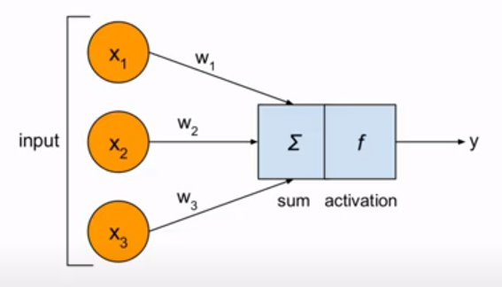
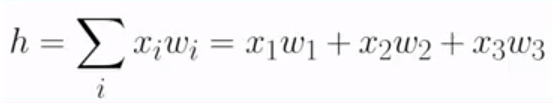
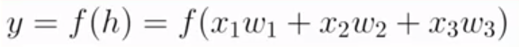
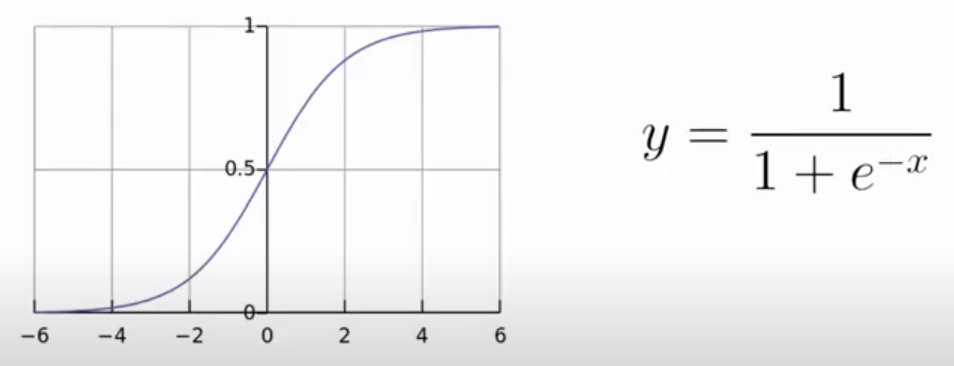
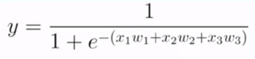
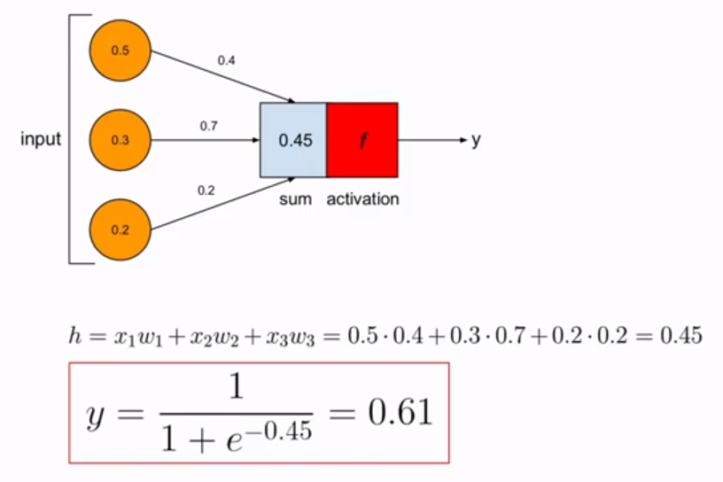

## Table of Contents

<!-- prettier-ignore -->
1. [Learning Outcomes](#learning-outcomes)
2. [Artificial Neuron](#artificial-neuron)
   1. [SUM ( h )](#sum--σ)
   2. [Output ( y )](#output--y)
3. [The artificial neuron with sigmoid activation function]( #the-artificial-neuron-with-sigmoid-activation-function)
<!-- 1. []() -->

&nbsp;

## Learning Outcomes

- Artificial neuron
- Math behind the artificial neuron
- How to implementing an artificial neuron with Python

&nbsp;

## Artificial Neuron

<!--  -->


- X1, X2, X3 are inputs
- w1, w2, w3 are weights associated to inputs
- sum ( Σ ) + activation function = cell body of a neuron
- y is output of a neuron

&nbsp;

### SUM ( Σ )



- h stands for net input (input \* respective weight)

&nbsp;

### Output ( y )



- y = activation function \* net input

&nbsp;

### Sigmoid Activation Function



- A sigmoid function in an artificial neuron is a mathematical function
- The sigmoid function introduces non-linearity into the neuron's output
- It maps the weighted sum of inputs to an output between 0 and 1
- Often used for binary classification tasks, where the output represents a probability
- It serves as an activation function, determining when the neuron should fire or remain inactive in response to input data

&nbsp;

```
"It serves as an activation function, determining when the neuron should fire or remain inactive in response to input data"

    Think of the sigmoid function as a switch for an artificial neuron. It decides whether the neuron should be "on" (fire) or "off" (inactive) based on the input it receives. The output of the sigmoid function, which ranges from 0 to 1, helps determine this decision. When the output is close to 1, the neuron is more likely to fire, and when it's close to 0, the neuron remains inactive. This decision is crucial for tasks like classifying whether an input belongs to one category or another in binary classification.
```



&nbsp;

## The artificial neuron with sigmoid activation function


