## Table of Contents

<!-- prettier-ignore -->
1. [What are Vectors?](#what-are-vectors)
2. [Operations of Vector](#operations-of-vectors)
    1. [Scaler Addition](#scaler-addition)
    2. [Scaler Multiplication](#scaler-multiplication)
    3. [Vector Addition](#vector-addition)
    4. [Dot Product](#dot-product)
3. [What are Matrix?](#what-are-matrix)
4. [Matrix Dimensions](#matrix-dimensions)
5. [Rows and Column Vectors](#row-and-column-vectors)
6. [Matrix Transposition](#matrix-transposition)
7. [Operations of Matrix](#operations-of-matrix)
    1. [Matrix Addition](#matrix-additionsubstraction)
    2. [Matrix Multiplication](#matrix-multiplication)
<!-- 1.  -->

&nbsp;

## What are Vectors?

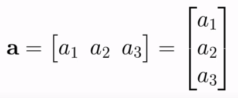

- vectors are arrays of numbers

- In deep learning, vectors are often used to represent data, such as input features or neural network weights, as arrays of numerical values.

- These numerical values can represent various types of information,

  - pixel values in an image
  - word embeddings in natural language processing
  - feature values in tabular data

- We denote vectors by lowercase letters such as a, b, c ... etc

- vector could be vetical (column vector) or horizontal (row vector)

&nbsp;

## Operations of Vectors

- Vectors can perform number of difference operations. One of the simple operation is 'Scalar Operation'

1. Scalar operation:

   - This operartion invloves 'vector' and 'scaler'
   - Scaler is a number like 0.5, 2
   - There are multiple scaler operations -
     - Scaler addition/substraction/multiplication/division

2. Vector Addition/Substraction
3. Dot product

&nbsp;

### Scaler Addition:

- a is vector and n is scaler

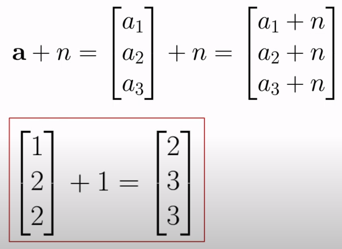

### Scaler Multiplication:

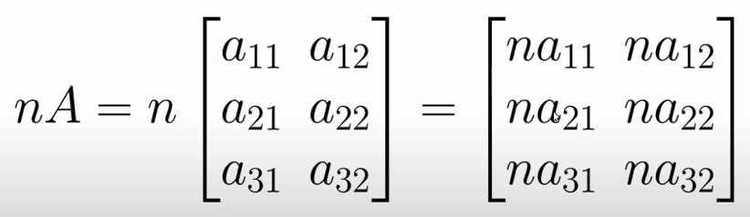

### Vector Addition:

- Performs between two vectors
- Both vectors must have same dimension
- Element-wise operation

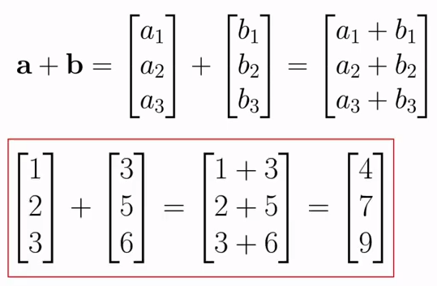

### Dot product:

- Performs between two vectors
- Result/outcome is a scaler

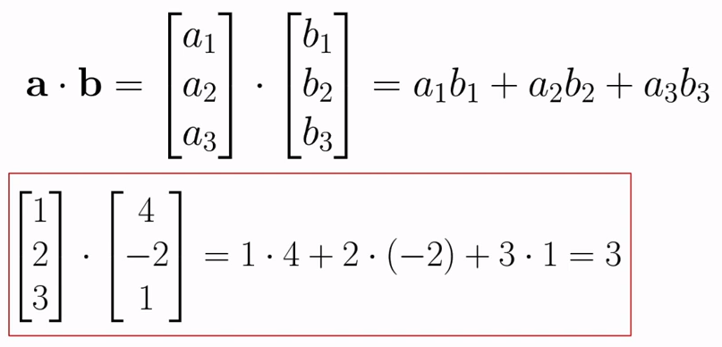

&nbsp;

<h3 style="color: pink">Rewrite the notation of the Artificial Neuron</h3>

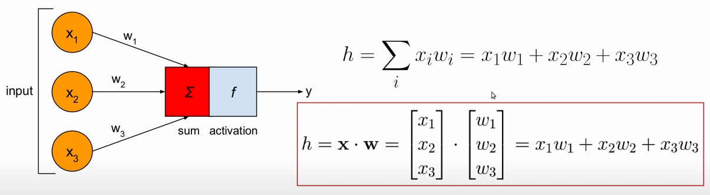

   

---

  

## What are Matrix?

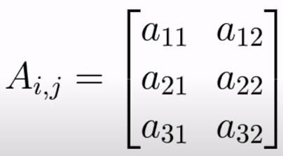

- Simply, Matrics are rectangular grid of numbers (like a spreadsheet)

- Matrics in deep learning typically refer to single numerical values or sets of numerical values

- Matrics are used to measure and evaluate the performance of machine learning models

- Matrics denoted by uppercase letters like A, B, C ... etc
  - In this example, **i** and **j** are indexes of the matrics
  - i represent rows, and j represent columns

&nbsp;

## Matrix Dimensions

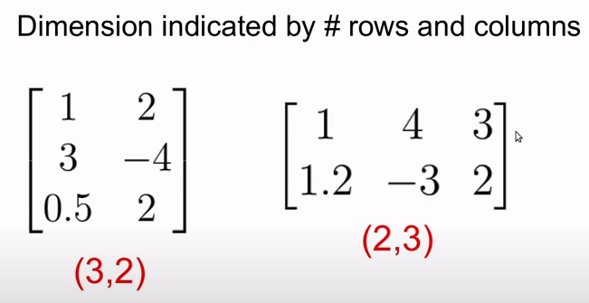

&nbsp;

## Row and column vectors

- If matrix has 1 row and **n** number of columns => (1, n), that matrix is called a row vector
- If matrix has **n** number of rows and 1 column => (n, 1), that matrix is called a column vector

&nbsp;

## Matrix Transposition

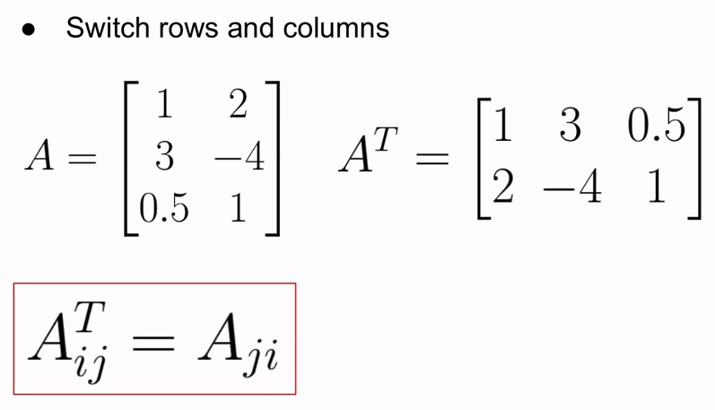

&nbsp;

## Operations of Matrix

1. Matrix addition/substraction
2. Matrix multiplication

&nbsp;

### Matrix addition/substraction

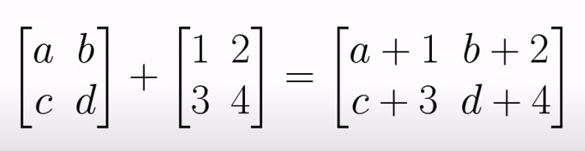

&nbsp;

### Matrix Multiplication

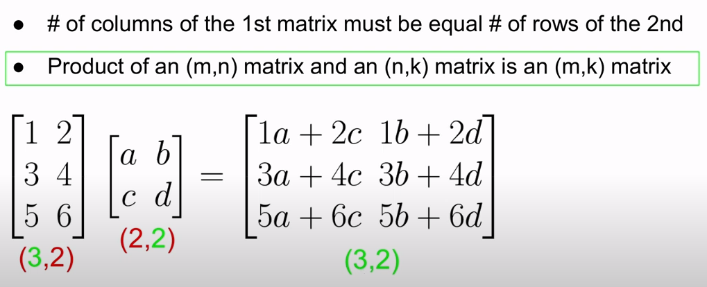

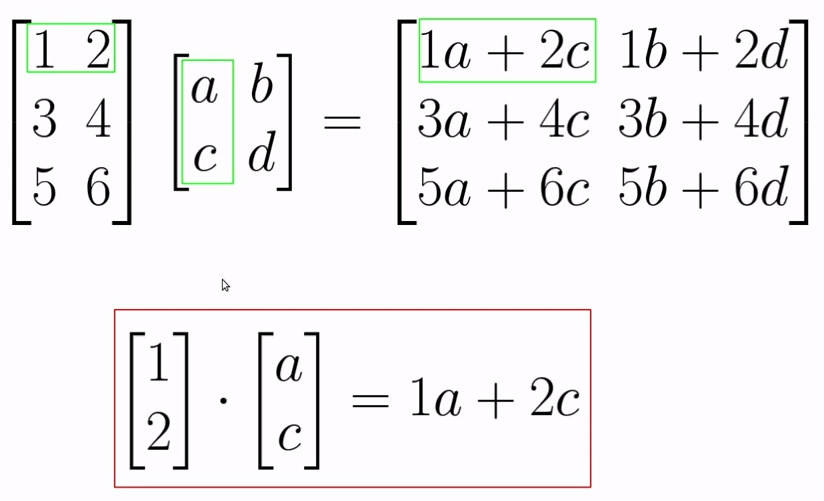
